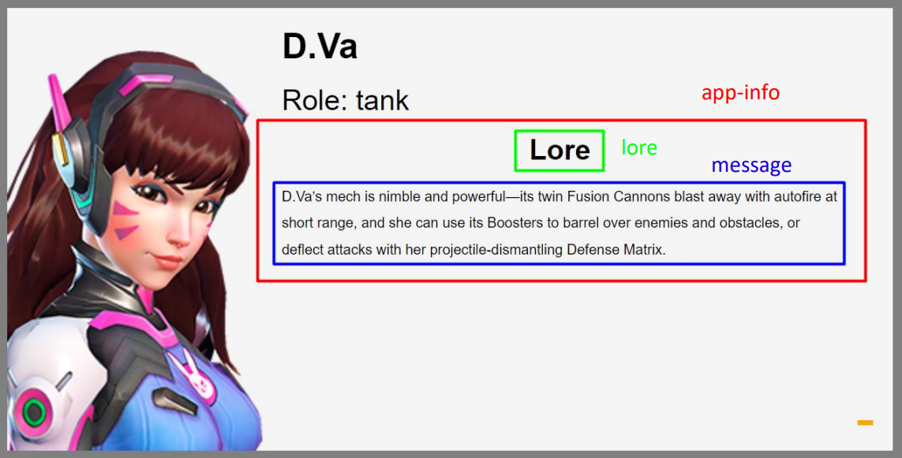

# Overwatch-API
The aim of this exercise is to design and implement a web application that allows you to search for Overwatch characters and obtain information about them.
The design of the website has to be fully responsive and the application has to interact with an API asynchronously using HTML, CSS and JavaScript. 

## Database
The database of Heroes is a JSON file with an array ("overwatch") of objects with the following schema:
```
{
  "key": String,      // identifier of the Heroe
  "name": String,     // name of the Heroe
  "role": String,     // role of the Heroe  (support, damage, tank)
  "portrait": String, // url of the portrait of the Heroe
  "message": String   // description of the Heroe
}
```
This database can be found in data.json file and the API to get the information is in app.js.

## General Overview


### Vue Singleton
index.js is our main javascript file where we create the Vue instance app as a Singleton.

It has search.js, list.js and info.js as childs and they will be able to use the variables heroes (array of objects) and refresh (boolean).

### Search component
search.js is a Vue component called app-search. It has a form with an input and a button that makes a GET call to the API from a string entered by the user that allows search by the following database fields: "key", "name", "role" and "message".

A submitForm() method communicates asynchronously with the API GET method. The API receives as a parameter the variable textToSearch and returns a list of heroes matching the string. Finally we pass this list of heroes to the Singleton's array of heroes.

### List component
list.js is a Vue component called app-list that is responsible of displaying the list of heroes and making a POST call to the API whenever it is requested.
Each item from the list shows the portrait, name and role of the Hero with a "more data" option to load more information.


Each item can be clicked to a "more data" option to show more information inside. When clicked, a loader is displayed while querying the API and when data is available, information is displayed according to the "message" field in the database.

A infoButton() method communicates asynchronously with the API POST method. The API receives as parameter the key variable of the hero object and returns the message of the hero that we have introduced, finally we assign it to the message attribute of our hero object.

### Info component
info.js is a Vue component called app-info that is responsible of displaying a Lore title and the hero's message if requested.



Receives lore and message properties directly from the Vue component app-list.

## Installation
1. Clone this repository
2. Open CMD in the download directory and execute the following npm commands:
```
npm install
```
```
npm run build
```
```
npm start
```
3. Go to http://localhost:3000/ in your web browser

## Concepts developed in this project:
- Develop a reponsive website for desktop and mobile.
- Use flex and grid.
- Work using components from the Vue.js package.
- Use Vue instance as Singleton to activate reactivity in components.
- Use the GET and POST methods of a local API asynchronously.
- Use Node.js to build the website.
